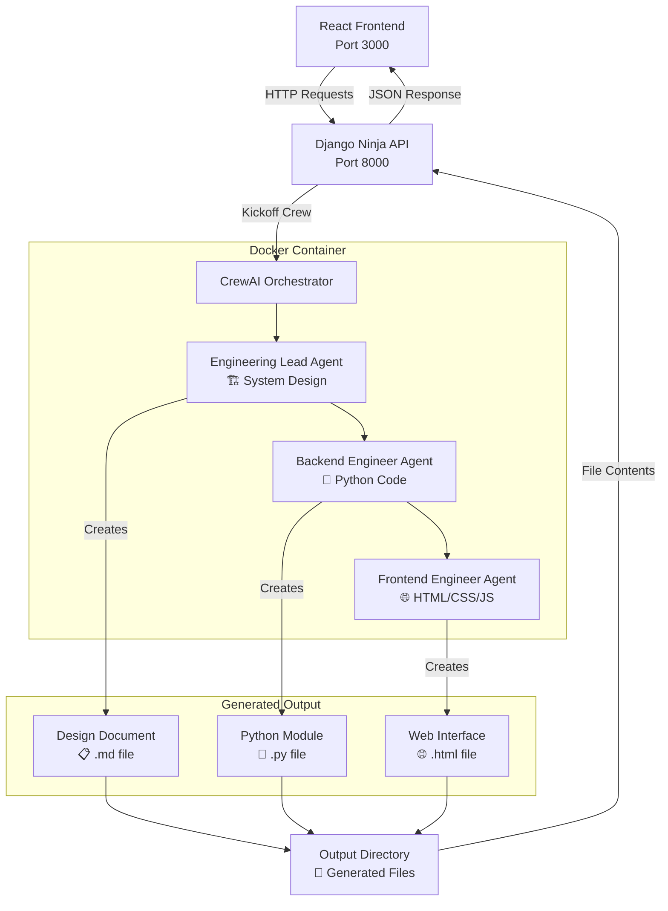

# CodeCraft AI
**Intelligent code generation platform that transforms natural language ideas into production-ready applications through AI-powered development teams.**

• AI-powered multi-agent code generation system  
• Complete full-stack application development  
• Natural language to production-ready code transformation  

**AI AGENTS • DEVELOPMENT • PYTHON • REACT • DJANGO**

---

## 🚀 What is CodeCraft AI?

CodeCraft AI is an intelligent code generation platform that takes your project ideas in plain English and crafts complete applications with:
- **Python backend modules** with complete business logic
- **Frontend HTML/CSS/JS** interfaces
- **Te

## 🏗️ Architecture



## 🤖 CrewAI Agents

The system uses three specialized AI agents working in sequence:

### 1. Engineering Lead
- **Role**: System architect and design lead
- **Task**: Analyzes requirements and creates detailed technical design
- **Output**: Design document with architecture and specifications

### 2. Backend Engineer  
- **Role**: Python developer
- **Task**: Implements the design as a complete Python module
- **Output**: Production-ready Python code with classes and methods

### 3. Frontend Engineer
- **Role**: Web developer
- **Task**: Creates responsive HTML/CSS/JS interface
- **Output**: Self-contained HTML file with modern styling

## 🛠️ Tech Stack

**Backend:**
- Django 5.1+ with Django Ninja API
- CrewAI for AI agent orchestration
- Google Gemini 1.5 Flash LLM
- SQLite database

**Frontend:**
- React 18 with modern hooks
- Tailwind CSS for styling
- Axios for API communication
- Lucide React icons

## 📋 Features

- ✨ **Natural Language Input**: Describe your project in plain English
- 🔄 **Real-time Generation**: Watch as AI agents create your code
- 📱 **Responsive UI**: Works on desktop and mobile devices
- 📥 **Download Code**: Get generated files instantly
- 🎯 **Production Ready**: Generated code follows best practices
- 🚀 **Fast API**: High-performance Django Ninja endpoints

## 🚀 Quick Start

### Prerequisites
- Python 3.10+
- Node.js 16+
- **Docker** (Required for CrewAI agents)
- Google Gemini API key

> ⚠️ **Docker is mandatory** - CrewAI agents run in Docker containers for safe code execution

### 1. Start Docker
```bash
# Make sure Docker is running
docker --version
# Start Docker Desktop or Docker daemon
```

### 2. Backend Setup
```bash
cd app
pip install -r requirements.txt
python manage.py migrate
python manage.py runserver
```

### 3. Frontend Setup
```bash
cd frontend
npm install
npm start
```

### 4. Environment Variables
Create `app/.env`:
```env
MODEL=gemini/gemini-1.5-flash
GEMINI_API_KEY=your_gemini_api_key_here
```

### 5. Usage
1. **Start Backend**: Django API runs on http://localhost:8000
2. **Start Frontend**: React app runs on http://localhost:3000
3. Open http://localhost:3000 in your browser
4. Enter your project requirements
5. Specify module and class names
6. Click "Generate Code"
7. Download your generated files

### 🔧 Running Backend & Frontend

**Backend (Django API):**
```bash
cd app
python manage.py runserver
# API available at: http://localhost:8000/api/
# API docs at: http://localhost:8000/api/docs
```

**Frontend (React App):**
```bash
cd frontend
npm start
# Web app available at: http://localhost:3000
```

> **Note**: Both backend and frontend must be running simultaneously for the application to work properly.

## 📝 Example

**Input:**
```
Build me a todo web app in cyberpunk style
```

**Generated Code:**

**todo_app.py**
```python
class TodoApp:
    def __init__(self):
        self.tasks = []
        self.task_id_counter = 1
    
    def add_task(self, title, description=""):
        task = {
            'id': self.task_id_counter,
            'title': title,
            'description': description,
            'completed': False,
            'created_at': datetime.now()
        }
        self.tasks.append(task)
        self.task_id_counter += 1
        return task
    
    def complete_task(self, task_id):
        for task in self.tasks:
            if task['id'] == task_id:
                task['completed'] = True
                return task
        return None
    
    def get_tasks(self, completed=None):
        if completed is None:
            return self.tasks
        return [task for task in self.tasks if task['completed'] == completed]
```

**index.html** (Cyberpunk styled)
```html
<!DOCTYPE html>
<html lang="en">
<head>
    <meta charset="UTF-8">
    <title>Cyberpunk To-Do</title>
    <style>
        body {
            background-color: #111;
            color: #0f0;
            font-family: 'Courier New', monospace;
        }
        .container {
            max-width: 600px;
            margin: 20px auto;
            padding: 20px;
            border: 1px solid #0f0;
            box-shadow: 0 0 10px rgba(0, 255, 255, 0.5);
        }
        h1 {
            color: #0ff;
            text-shadow: 2px 2px 4px #000;
        }
        /* More cyberpunk styling... */
    </style>
</head>
<body>
    <div class="container">
        <h1>Cyberpunk To-Do</h1>
        <input type="text" id="newTask" placeholder="Enter new task">
        <button id="addTaskBtn">Add Task</button>
        <ul id="taskList"></ul>
    </div>
    <script>
        // Interactive JavaScript for task management
    </script>
</body>
</html>
```

**Output Files:**
- `todo_app.py` - Complete Python module with TodoApp class
- `index.html` - Cyberpunk-styled responsive web interface  
- `todo_app_design.md` - Technical documentation and specifications

## 🔧 API Endpoints

- `POST /api/run` - Generate code from requirements
- `GET /api/health` - Health check endpoint
- `GET /api/docs` - Interactive API documentation

## 🤝 Contributing

1. Fork the repository
2. Create a feature branch
3. Make your changes
4. Submit a pull request

## 📄 License

MIT License - see LICENSE file for details

## 🙏 Acknowledgments

- [CrewAI](https://github.com/joaomdmoura/crewAI) for the multi-agent framework
- [Django Ninja](https://django-ninja.rest-framework.com/) for the fast API
- [Google Gemini](https://ai.google.dev/) for the language model

---

**CodeCraft AI** - Where ideas become code ✨