# 🤖 AICOP - AI-Powered Development Crew

> **Transform your ideas into working software with AI agents!**

AICOP is an intelligent software development crew powered by [CrewAI](https://crewai.com) that automatically builds complete applications from simple requirements. Just describe what you want, and watch as AI agents collaborate to design, code, test, and create a user interface for your project!

## 🎯 What Does AICOP Do?

AICOP takes your high-level requirements and transforms them into a complete, working application through a team of specialized AI agents:

```
Your Idea → AI Agents → Complete Application
    ↓           ↓              ↓
"I need a     🤖 Design      ✅ Working Code
 trading      🤖 Code        ✅ User Interface  
 system"      🤖 Test        ✅ Unit Tests
              🤖 UI
```

## 🏗️ How It Works - The AI Development Pipeline

```mermaid
graph TD
    A[📝 Your Requirements] --> B[🎯 Engineering Lead]
    B --> C[💻 Backend Engineer]
    C --> D[🎨 Frontend Engineer]
    C --> E[🧪 Test Engineer]
    
    B --> F[📋 Design Document]
    C --> G[🐍 Python Code]
    D --> H[🖥️ Gradio UI]
    E --> I[✅ Unit Tests]
    
    style A fill:#e1f5fe
    style F fill:#f3e5f5
    style G fill:#e8f5e8
    style H fill:#fff3e0
    style I fill:#fce4ec
```



### Meet Your AI Development Team

| Agent | Role | What They Do |
|-------|------|--------------|
| 🎯 **Engineering Lead** | Project Manager | Analyzes requirements and creates detailed technical designs |
| 💻 **Backend Engineer** | Python Developer | Writes clean, efficient Python code based on the design |
| 🎨 **Frontend Engineer** | UI Developer | Creates simple Gradio web interfaces to demo your app |
| 🧪 **Test Engineer** | QA Specialist | Writes comprehensive unit tests to ensure code quality |

## 🚀 Quick Start

### Prerequisites
- Python 3.10 - 3.13
- Basic command line knowledge

### Installation

1. **Install UV package manager:**
   ```bash
   pip install uv
   ```

2. **Set up your OpenAI API key:**
   - Copy `.env.example` to `.env` (if it exists)
   - Add your OpenAI API key:
   ```
   OPENAI_API_KEY=your_api_key_here
   ```

3. **Install dependencies:**
   ```bash
   crewai install
   ```

### Run Your First Project

```bash
crewai run
```

That's it! AICOP will build a complete trading account management system as a demo.

## 📁 Project Structure

```
aicop/
├── 📄 README.md              # You are here!
├── ⚙️ pyproject.toml          # Project configuration
├── 🔑 .env                   # Your API keys (create this)
├── 📁 src/aicop/
│   ├── 🤖 crew.py            # AI agents definition
│   ├── 🎯 main.py            # Main execution script
│   └── 📁 config/
│       ├── 👥 agents.yaml    # Agent configurations
│       └── 📋 tasks.yaml     # Task definitions
├── 📁 output/                # Generated code appears here
│   ├── 📄 accounts.py        # Generated backend code
│   ├── 🖥️ app.py             # Generated UI
│   ├── 🧪 test_accounts.py   # Generated tests
│   └── 📋 accounts_design.md # Design document
└── 📁 knowledge/             # Additional context files
```

## 🎮 Example: What AICOP Builds

When you run the default example, AICOP creates a **Trading Account Management System**:

### Generated Files:
- **`accounts.py`** - Complete Python class with methods for deposits, withdrawals, buying/selling stocks
- **`app.py`** - Interactive web interface using Gradio
- **`test_accounts.py`** - Comprehensive unit tests
- **`accounts_design.md`** - Technical design documentation

### Features Built:
- ✅ Account creation and management
- ✅ Deposit and withdrawal functionality
- ✅ Stock trading simulation
- ✅ Portfolio value calculation
- ✅ Profit/loss tracking
- ✅ Transaction history
- ✅ Web-based user interface
- ✅ Complete test coverage

## 🛠️ Customizing AICOP

### 1. Modify Requirements
Edit `src/aicop/main.py` and change the `requirements` variable:

```python
requirements = """
Your custom project requirements here.
For example: A task management system that allows users to...
"""
```

### 2. Configure Agents
Edit `src/aicop/config/agents.yaml` to customize:
- Agent roles and responsibilities
- AI models used (currently using Gemini)
- Agent backstories and personalities

### 3. Adjust Tasks
Edit `src/aicop/config/tasks.yaml` to modify:
- Task descriptions and expectations
- Output file locations
- Task dependencies

## 🔧 Advanced Usage

### Running Specific Commands

```bash
# Train the crew (improve performance over time)
crewai train

# Replay a previous execution
crewai replay

# Run tests on generated code
crewai test
```

### Adding Custom Tools

You can extend AICOP by adding custom tools in the `src/aicop/tools/` directory for specialized functionality like:
- Database connections
- API integrations
- File processing
- External service calls

## 🎯 Use Cases

AICOP is perfect for:

- 🏗️ **Rapid Prototyping** - Turn ideas into working demos quickly
- 📚 **Learning Projects** - See how AI approaches software design
- 🧪 **Proof of Concepts** - Validate ideas before full development
- 🎓 **Educational Tools** - Understand software architecture patterns
- 🚀 **Startup MVPs** - Get from concept to demo fast

## 🤝 Contributing

Want to improve AICOP? Here's how:

1. Fork the repository
2. Create a feature branch
3. Make your changes
4. Test with different requirements
5. Submit a pull request

## 📚 Learn More

- [CrewAI Documentation](https://docs.crewai.com)
- [CrewAI GitHub](https://github.com/joaomdmoura/crewai)
- [Join CrewAI Discord](https://discord.com/invite/X4JWnZnxPb)

## 🆘 Troubleshooting

### Common Issues:

**"No module named 'crewai'"**
```bash
pip install crewai[tools]
```

**"OpenAI API key not found"**
- Make sure you have a `.env` file with `OPENAI_API_KEY=your_key`

**"Permission denied"**
- On Windows, run command prompt as administrator
- On Mac/Linux, use `sudo` if needed

**Generated code has errors**
- Check the `output/` folder for all generated files
- Review the design document first
- Try running with different requirements

---

## 🌟 Ready to Build Something Amazing?

1. Set up your API key
2. Run `crewai run`
3. Watch the magic happen!
4. Customize for your own projects

**Happy coding with your AI development crew! 🚀**