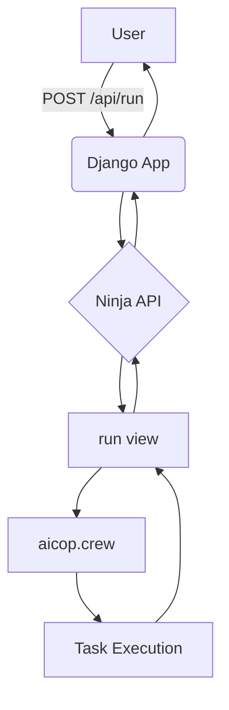

# AI Co-Pilot API

This project is a Django-based API that uses an AI-powered engineering team to perform tasks based on user requirements.

## Features

-   **API:** A simple and clean API to receive requests.
-   **AI-Powered Engineering Team:** Leverages an AI crew to handle complex tasks.
-   **Modular Design:** The project is structured with a core application to handle the main logic.

## Getting Started

### Prerequisites

-   Python 3.9+
-   pip

### Installation

1.  **Clone the repository:**

    ```bash
    git clone <repository-url>
    cd app
    ```

2.  **Create a virtual environment:**

    ```bash
    python -m venv venv
    source venv/bin/activate  # On Windows use `venv\Scripts\activate`
    ```

3.  **Install the dependencies:**

    A `requirements.txt` file is not yet present in the project. You can create one with the following content:

    ```
    Django
    django-ninja
    ```

    Then install the dependencies:

    ```bash
    pip install -r requirements.txt
    ```

    You will also need to install the `aicop` library. Please refer to its documentation for installation instructions.

4.  **Run the migrations:**

    ```bash
    python manage.py migrate
    ```

5.  **Run the development server:**

    ```bash
    python manage.py runserver
    ```

    The API will be available at `http://127.0.0.1:8000/api/`.

## Project Structure

```
.
├── app
│   ├── __init__.py
│   ├── asgi.py
│   ├── settings.py
│   ├── urls.py
│   └── wsgi.py
├── core
│   ├── __init__.py
│   ├── admin.py
│   ├── api.py
│   ├── apps.py
│   ├── migrations
│   ├── models.py
│   ├── tests.py
│   └── views.py
├── manage.py
└── README.md
```

## API Endpoints

### POST /api/run

This endpoint receives a request to run a task with the AI engineering team.

**Request Body:**

```json
{
  "requirements": "string",
  "module_name": "string",
  "class_name": "string"
}
```

**Response:**

```json
{
  "result": "string"
}
```

## Architecture Diagram

Here is a simple diagram to illustrate the flow of a request in the application:


